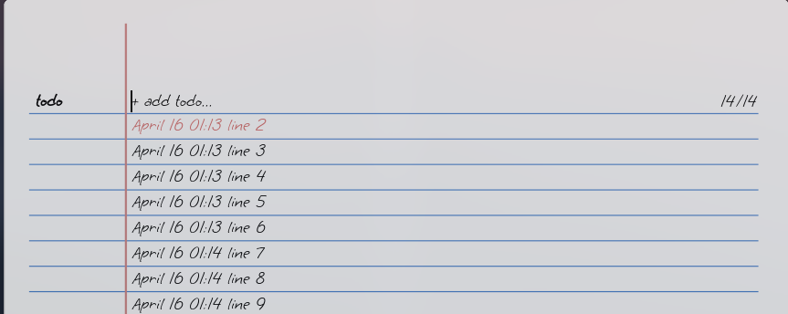
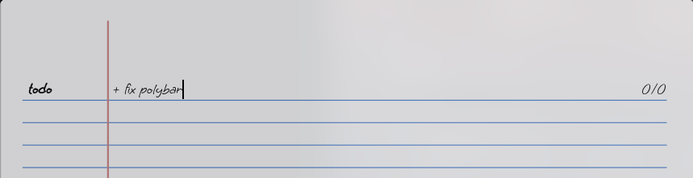
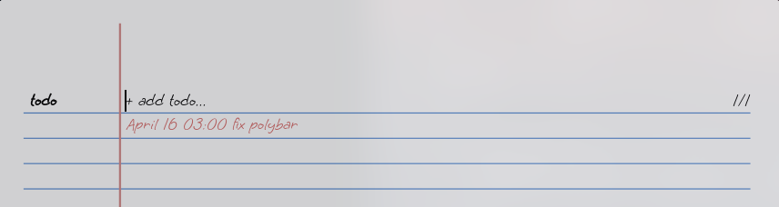

# rofi-todo.sh

Minimal todo client for the [rofi](https://github.com/DaveDavenport/rofi) launcher.

This project is a fork of: [claudiodangelis/rofi-todo](https://claudiodangelis/rofi-todo)

But with a **theme** 



# Installation

- clone repo to `~/.config/`
- Font used is located in `~/.config/rofi-todo/dependencies/fonts/`
    - to install move the fonts to `/usr/local/fonts/` and run `fc-cache -fv`
- Call the `launcher`  script 


## Example 

### i3wm

Add this line to i3 config file. Change `Mod1+P` to the shortcut you want to invoke `launcher` with

```
bindsym Mod1+P exec ~/.config/rofi-todo/launcher
```

### bspwm 
Add to sxhkdrc 
```
super + T
    sh ~/.config/rofi-todo/launcher
```

# Usage

## Add TODOs

> To add a new todo just start the line with a `+` sign, with no `white space` before it, then press Enter, for example:





> You will see:




## Search TODOs

> To search through todos just start typing 


## Mark TODOs as done

Use up/down arrows or start typing to select the TODO you want to mark as done, then press Enter.


 **Note:**  todos will be saved to a text file located at `~/.rofi_todos`.

### Save a copy of completed TODOs

To save a copy of your completed TODO items, specify `DONE_FILE`, e.g.:

**~/.profile**
```
export DONE_FILE=~/.rofi_todos_done
```

